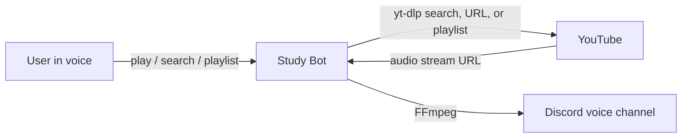

# Study Bot

A Discord bot for study sessions: timed focus lock-ins plus YouTube music in voice.

Prefix: **`!`**

**[Add Study Bot to your Discord server](https://discord.com/oauth2/authorize?client_id=1426077305922387980&permissions=8&integration_type=0&scope=bot)** — open that link, pick a server you have Manage Server on, and authorize. You do not need to host anything.

```
!study 25
!play lofi hip hop radio
!playlist lofi study beats
!search playlist lofi
!queue
!studyend
```

---

## What it does

### Study timers

- Starts a **Pomodoro-style focus session** (default 25 minutes; 1–180 allowed)
- Posts a live **`M:SS` countdown** in `#study` (creates the channel when it can)
- Locks you into the voice channel you started in — leaving mid-session posts a warning in `#study`
- Ends on its own when time runs out, or early with `!studyend`

### Music

- Plays audio from a YouTube search or URL (nothing is downloaded to disk)
- Keeps a **separate queue per Discord server**, so two guilds never share playback
- Lets you pick from the top 10 search results with a dropdown instead of typing a number
- Can enqueue a whole **YouTube playlist** (search or URL), capped at 100 tracks per add
- Supports pause, resume, skip, previous, replay, and a live queue embed
- Leaves automatically when it is the last member in the voice channel

---

## How it works

### Music



1. A command lands in `MusicCog`.
2. **yt-dlp** resolves a search or URL into a streamable audio source.
3. **FFmpeg** pipes that audio into Discord voice.
4. Queue position, pause state, and the voice client are stored **by guild ID**, so each server has its own player.

Search uses a Discord UI view (`bot/views/search.py`): a select menu of results plus a Cancel button. Choosing a row adds that track to the guild’s queue. Playlist search uses the same pattern (`bot/views/playlist.py`) and enqueues every track from the chosen playlist (up to 100), tagging them so `!remove playlist` can drop that batch later.

### Study sessions

1. You join a voice channel and run `!study` (optionally with minutes).
2. `StudyCog` posts a timer embed in `#study` (or creates `#study` if the bot has Manage Channels; otherwise it falls back to general-like channels).
3. The embed’s **Remaining** field ticks down once per second as `M:SS` (or `H:MM:SS` for longer sessions). **Started** shows the clock time the session began.
4. If you leave that voice channel before the timer ends, the bot posts a leave warning in the study text channel (no DM).
5. When time hits zero — or you run `!studyend` — the embed flips to a complete/ended state.

---

## Commands

Most music and study commands require you to already be in a voice channel.

### Study

| Command | Aliases | What it does |
| --- | --- | --- |
| `!study [minutes]` | `focus`, `pomodoro` | Start a focus timer in `#study` (default **25** min; range **1–180**). Must be in voice. |
| `!studyend` | `endstudy`, `endfocus`, `studystop` | Stop your active study session early |

One active session per user. Leaving the locked voice channel mid-session posts a warning in the study channel.

### Playback

| Command | Aliases | What it does |
| --- | --- | --- |
| `!play <query or URL>` | `pl` | Play the first match, or resume if you omit a query while paused. Playlist page URLs enqueue the whole playlist |
| `!playlist <query or URL>` | `plist`, `pllist` | Search playlists (or paste a playlist URL), enqueue tracks (up to **100**), and start playing |
| `!pause` | `stop` | Pause the current track |
| `!resume` | `re`, `start` | Resume a paused track |
| `!skip` | `sk`, `next` | Jump to the next song in the queue |
| `!previous` | `pr`, `prev` | Jump to the previous song (replays the current one if you are at the start) |
| `!replay` | `rep` | Restart the current song from the beginning |

### Queue

| Command | Aliases | What it does |
| --- | --- | --- |
| `!add <query or URL>` | `a`, `+` | Add a track without starting playback |
| `!search <query>` | `se`, `find` | Show the top 10 YouTube results; pick one from the dropdown |
| `!search playlist <query>` | *(same)* | Show playlist results; pick one to enqueue all its tracks |
| `!remove` | `rm` | Remove the last song that was added |
| `!remove playlist [name]` | `rm` + `playlist` | Remove a queued playlist batch (picker if several; optional name filter) |
| `!removeplaylist [name]` | `rmpl`, `rmplaylist` | Same as `!remove playlist` |
| `!queue` | `q`, `list` | Show the current track, the next track, and a few upcoming songs |
| `!clear` | `cl`, `removeall` | Stop playback and empty the queue |

### Voice and help

| Command | Aliases | What it does |
| --- | --- | --- |
| `!join` | `j` | Join your current voice channel |
| `!leave` | `l` | Leave voice and clear that server’s queue |
| `!help` | `h`, `?` | List commands inside Discord |

`!leave` also fires on its own if everyone else leaves the channel.

---

## Project layout

```
Study-Bot/
├── main.py                 # thin entry (`python main.py`)
├── bot/
│   ├── app.py              # bot factory, intents, error handler
│   ├── cogs/
│   │   ├── music.py        # queue, playback, YouTube, voice, playlists
│   │   ├── study.py        # focus timers, #study channel, leave warnings
│   │   ├── help.py         # !help + startup greeting
│   │   └── admin.py        # stub for future admin commands
│   └── views/
│       ├── search.py       # !search dropdown + Cancel
│       └── playlist.py     # playlist search / remove dropdowns
├── docs/DEPLOYMENT.md      # local setup and Oracle Cloud Always Free deploy
├── scripts/smoke.py
├── tests/                  # music + study helpers, app startup
├── requirements.txt
└── .env.example
```

You can also start with `python -m bot`.

---

## Setup

To use the hosted bot, skip this section and use the [invite link](https://discord.com/oauth2/authorize?client_id=1426077305922387980&permissions=8&integration_type=0&scope=bot) above. To run your own instance on a free always-on VM, follow [docs/DEPLOYMENT.md](docs/DEPLOYMENT.md). The steps below are the local install.

### 1. Prerequisites

| Tool | Why |
| --- | --- |
| **Python 3.10+** | Runs the bot |
| **[FFmpeg](https://ffmpeg.org/download.html)** | Streams audio into Discord voice. Put a Linux binary at `bin/ffmpeg` if the bundled copy crashes (common on WSL). |
| **[Node.js](https://nodejs.org/)** | yt-dlp uses it to extract YouTube audio |

Quick checks:

```bash
python3 --version
ffmpeg -version
node --version
```

### 2. Create a Discord bot

1. Open the [Discord Developer Portal](https://discord.com/developers/applications) and create an application.
2. Under **Bot**, reset the token and copy it. Do not commit this value.
3. Enable these **Privileged Gateway Intents**:
   - Message Content Intent (required for `!` prefix commands)
   - Server Members Intent
4. Invite the bot to a server with the `bot` scope and at least:
   - Read Messages / View Channels
   - Send Messages
   - Embed Links
   - Manage Channels (optional; lets the bot create `#study` for timers)
   - Connect
   - Speak
   - Read Message History

### 3. Install and run

```bash
git clone https://github.com/YOUR_USERNAME/Study-Bot.git
cd Study-Bot

python3 -m venv .venv
source .venv/bin/activate        # Windows: .venv\Scripts\activate

pip install -r requirements.txt
```

Copy `.env.example` to `.env` and paste your token:

```bash
cp .env.example .env
```

```
DISCORD_TOKEN=your_bot_token_here
```

If Node is not on your `PATH` (common on Windows), set the full path:

```
NODE_PATH=C:\Program Files\nodejs\node.exe
```

Start the bot:

```bash
python main.py
```

Join a voice channel, then try `!help`, `!study`, or `!play lofi study beats`.

---

## Notes and limits

- Study timers need you in a voice channel first. Duration is **1–180** minutes (default **25**). One session per user at a time.
- Leave-mid-session warnings go to the study text channel only — the bot does not DM you.
- If `#study` (or `study-chat` / `studychat`) is missing and Manage Channels is unavailable, the timer falls back to channels like `#general`, then the system channel, then any sendable text channel.
- YouTube changes extraction often. If search or play suddenly fails, update yt-dlp: `pip install -U yt-dlp`.
- Single-track `!play` / `!add` / `!search` still use `noplaylist`, so a `watch?v=…&list=…` link plays that video only. Use `!playlist` (or a `/playlist?list=…` URL with `!play`) to enqueue the full list.
- Playlist adds are capped at **100** tracks per enqueue. Streams resolve lazily when each track starts, not all at once.
- `!play` without arguments resumes a paused song; it does not start a new search.
- The bot token belongs in `.env` only. That file is gitignored.

---

## Development checks

CI runs on every push and pull request to `main` (lint, syntax, tests, smoke import). Dependabot keeps pip packages and GitHub Actions up to date. CodeQL runs on push/PR and weekly.

```bash
pip install -r requirements-dev.txt
ruff check .
python -m compileall -q .
pytest
python scripts/smoke.py
```

---

## Stack

[Python](https://www.python.org/) · [discord.py](https://discordpy.readthedocs.io/) · [PyNaCl](https://pypi.org/project/PyNaCl/) · [davey](https://pypi.org/project/davey/) · [yt-dlp](https://github.com/yt-dlp/yt-dlp) · [FFmpeg](https://ffmpeg.org/) · [python-dotenv](https://pypi.org/project/python-dotenv/)
