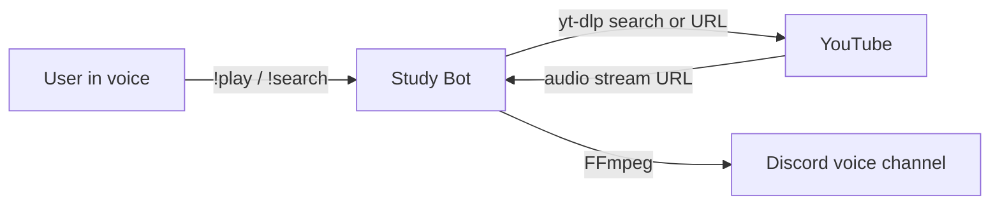

# Study Bot

A Discord music bot for study sessions: search YouTube, queue tracks, and control playback from a voice channel.

Prefix: **`!`**

```
!play lofi hip hop radio
!search never gonna give you up
!queue
!skip
```

---

## What it does

- Plays audio from a YouTube search or URL (nothing is downloaded to disk)
- Keeps a **separate queue per Discord server**, so two guilds never share playback
- Lets you pick from the top 10 search results with a dropdown instead of typing a number
- Supports pause, resume, skip, previous, replay, and a live queue embed
- Leaves automatically when it is the last member in the voice channel

---

## How it works



1. A command lands in `MusicCog`.
2. **yt-dlp** resolves a search or URL into a streamable audio source.
3. **FFmpeg** pipes that audio into Discord voice.
4. Queue position, pause state, and the voice client are stored **by guild ID**, so each server has its own player.

Search uses a Discord UI view (`view.py`): a select menu of results plus a Cancel button. Choosing a row adds that track to the guild’s queue.

---

## Commands

Most music commands require you to already be in a voice channel.

### Playback

| Command | Aliases | What it does |
| --- | --- | --- |
| `!play <query or URL>` | `pl` | Play the first match, or resume if you omit a query while paused |
| `!pause` | `stop` | Pause the current track |
| `!resume` | `re`, `start` | Resume a paused track |
| `!skip` | `sk`, `next` | Jump to the next song in the queue |
| `!previous` | `pr`, `prev` | Jump to the previous song (replays the current one if you are at the start) |
| `!replay` | `rep` | Restart the current song from the beginning |

### Queue

| Command | Aliases | What it does |
| --- | --- | --- |
| `!add <query or URL>` | `a`, `+` | Add a track without starting playback |
| `!search <query>` | `se`, `find` | Show the top 10 YouTube results; pick one from the dropdown |
| `!remove` | `rm` | Remove the last song that was added |
| `!queue` | `q`, `list` | Show the current track, the next track, and a few upcoming songs |
| `!clear` | `cl`, `removeall` | Stop playback and empty the queue |

### Voice and help

| Command | Aliases | What it does |
| --- | --- | --- |
| `!join` | `j` | Join your current voice channel |
| `!leave` | `l` | Leave voice and clear that server’s queue |
| `!help` | `h` | List commands inside Discord |

`!leave` also fires on its own if everyone else leaves the channel.

---

## Project layout

| File | Role |
| --- | --- |
| `main.py` | Entry point: loads the token, intents, and cogs |
| `music_cog.py` | Queue, playback, YouTube lookup, voice join/leave |
| `help_cog.py` | `!help` embed and the startup greeting |
| `view.py` | Dropdown + Cancel button for `!search` |
| `admin_cog.py` | Stub cog reserved for future admin commands |
| `requirements.txt` | Python dependencies |
| `.env.example` | Template for local secrets |

---

## Setup

### 1. Prerequisites

| Tool | Why |
| --- | --- |
| **Python 3.10+** | Runs the bot |
| **[FFmpeg](https://ffmpeg.org/download.html)** | Streams audio into Discord voice (must be on your `PATH`) |
| **[Node.js](https://nodejs.org/)** | yt-dlp uses it to extract YouTube audio |

Quick checks:

```bash
python3 --version
ffmpeg -version
node --version
```

### 2. Create a Discord bot

1. Open the [Discord Developer Portal](https://discord.com/developers/applications) and create an application.
2. Under **Bot**, reset the token and copy it. Do not commit this value.
3. Enable these **Privileged Gateway Intents**:
   - Message Content Intent (required for `!` prefix commands)
   - Server Members Intent
4. Invite the bot to a server with the `bot` scope and at least:
   - Read Messages / View Channels
   - Send Messages
   - Embed Links
   - Connect
   - Speak
   - Read Message History

### 3. Install and run

```bash
git clone https://github.com/YOUR_USERNAME/Study-Bot.git
cd Study-Bot

python3 -m venv .venv
source .venv/bin/activate        # Windows: .venv\Scripts\activate

pip install -r requirements.txt
```

Copy `.env.example` to `.env` and paste your token:

```bash
cp .env.example .env
```

```
DISCORD_TOKEN=your_bot_token_here
```

If Node is not on your `PATH` (common on Windows), set the full path:

```
NODE_PATH=C:\Program Files\nodejs\node.exe
```

Start the bot:

```bash
python main.py
```

Join a voice channel, then try `!help` or `!play lofi study beats`.

---

## Notes and limits

- YouTube changes extraction often. If search or play suddenly fails, update yt-dlp: `pip install -U yt-dlp`.
- Playlists are disabled (`noplaylist`). One URL or search term maps to one track.
- `!play` without arguments resumes a paused song; it does not start a new search.
- The bot token belongs in `.env` only. That file is gitignored.

---

## Stack

[Python](https://www.python.org/) · [discord.py](https://discordpy.readthedocs.io/) · [yt-dlp](https://github.com/yt-dlp/yt-dlp) · [FFmpeg](https://ffmpeg.org/) · [python-dotenv](https://pypi.org/project/python-dotenv/)
